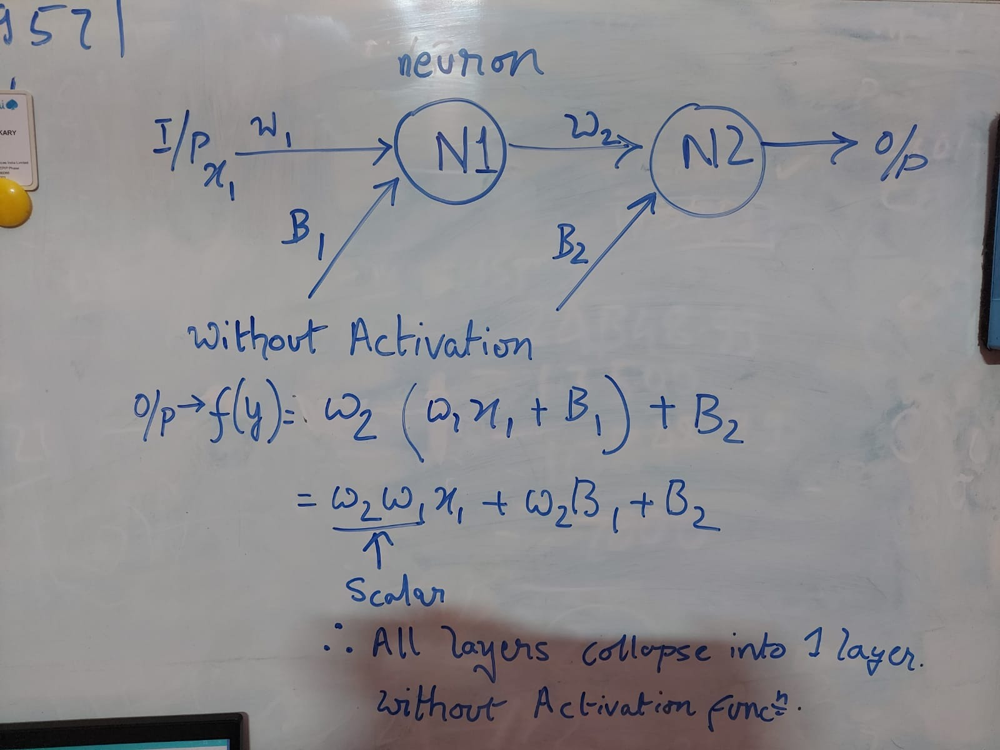

# TSAI - END3 Session 1 Assignment
*Group Members: Dhruba Adhikary, Phani Nandula, Prateek Maheshwari, Sujit Ojha*

# Part 1 - Rewriting the Code

- [Notebook](END3_ASSIGNMENT_1.ipynb) with problem statement, different iterations and conclusion.
- **Conclusions**
  1. Tried out 3 different neural network architectures that meet the total parameter requirement of 44.
  2. We have changed 
      * A. optimizer from SGD to ADAM, 
      * B. loss from L1 loss to MSE,
      * C. Activation function from tanh to Sigmoid.
      * D. Number of epochs from 300 to 2001.
      * E. Removed activation from the last layer of all the networks
  3. Model 3 is having most number of layers (9), and observed *vanishing gradient* issue since for inner layers gradients are zero and but loss is high as well as predictions are bad.

  4. Model 1 and Model 2 have better predictions.

- [Notebook with additional iterations](./Additional/END_3_0_Assignment_1_submission.ipynb) & [detailed readme](./Additional/README.md).

# Part 2 - Questions

## 1. What is a neural network neuron?
A neuron in an artificial neural network is an elementary block that mimics the functionality of human neurons. However, with stark difference that neurons/perceptron are enabled with memory storage for a very short duration of time and serve as an elementary computational block unlike the human neurons that allow for memory storage, computation and signalling. Also, unlike Human neuron where inputs may be termed as dendrites and outputs are via Axioms, the input and output lines for perceptron’s are termed as weights.


Each neuron is fed with an input along with associated weight and bias. A neuron has two functions:

\1) Accumulator function: It essentially is the weighted sum of input along with a bias added to it.
\2) Activation function: Activation functions are non-linear function. And as the name suggests is a function to decide whether output of a node will be actively participating in the overall output of the model or not. 


Now an Activation function plays a very critical task of converting the Acumulator function into non-linear space so that the layers might not collapse into 1 layer .

So essentially without activation function : 



With Activation Function : 


## 2. What is the use of the learning rate?

First off, what is a learning rate?

Learning rate is a hyper-parameter that controls how much we are adjusting the weights of our network with respect the loss gradient. The lower the value, the slower we travel along the downward slope. While this might be a good idea (using a low learning rate) in terms of making sure that we do not miss any local minima, it could also mean that we’ll be taking a long time to converge — especially if we get stuck on a plateau region.

The following formula shows the relationship.

New Weight = Old weight – Learning Rate \* Gradient.


Learning rate is one of the most important hyperparameter used while training deep learning models. Learning rate (```alpha```) determines the size of the steps which a Gradient Descent optimizer takes along the direction of the slope of the surface derived from the loss function towards local minima.

Basic steps involved in training a machine learning model is shown in below figure. Learning rate (```alpha```) is used in **updation of parameters** which are then used to re-calculate the loss and this cycle continues till we achieve desired accuracy (acceptable loss).


* **Small Learning rate** will slow down the training progress, but are also more desirable when the loss keeps getting worse or oscillates wildly. 
* **Large Learning rate** will accelerate the training progress rate and are beneficial when the loss is dropping fairly consistently in several consecutive iterations. However, large Learning rate value may also cause the training getting stuck at a local minimum, preventing the model from improving, resulting in either a low accuracy or not able to converge. 

Finding a constant learning rate that would improve the model is not always feasible and would involved several trails and errors to find the best values. Inspite of these iterations there may not be a fixed learning rate. There are several techniques that are evolved in the last few years and described below are some of the techniques available in Pytorch.

```torch.optim.lr_scheduler``` provides several methods to adjust the learning rate based on the number of epochs. ```torch.optim.lr_scheduler.ReduceLROnPlateau``` allows dynamic learning rate reducing based on some validation measurements.
* ```lr_scheduler.LambdaLR```
* ```lr_scheduler.MultiplicativeLR```
* ```lr_scheduler.StepLR```
* ```lr_scheduler.MultiStepLR```
* ```lr_scheduler.ExponentialLR```
* ```lr_scheduler.CyclicLR```
* ```lr_scheduler.OneCycleLR```
* ```lr_scheduler.CosineAnnealingLR```
* ```lr_scheduler.CosineAnnealingWarmRestarts```

### Sample code for ```lr_scheduler.StepLR```
```
# Assuming optimizer uses lr = 0.05 for all groups
# lr = 0.05     if epoch < 30
# lr = 0.005    if 30 <= epoch < 60
# lr = 0.0005   if 60 <= epoch < 90
# ...
scheduler = StepLR(optimizer, step_size=30, gamma=0.1)
for epoch in range(100):
    train(...)
    validate(...)
    scheduler.step()
```
As the number of epochs increase by a step of 30, Learning rate is multiplied by a factor of 0.1 (```gamma```).

## 3. How are weights initialized?

Weight initialization plays a significant role not only in convergence of results but also in faster convergence of results. Below table shows the effect of different weight initializations

| Initialization Method        | Explanation           | Effects  |
|:----------------------------: |:---------------------:| :--------|
| Zero/ Constant values to weights | All the weights initialized to ```zero``` or ```some constant value C``` | * Initializing all the weights with zeros or constant leads all the neurons to learn the same features during training since all the neurons have identical gradients resulting in an inefficient model. All neurons evolve symmetrically instead of learning different features.|
| Too small values to weights | All the weights initialized with lower values such as 0.5  |  The gradients of the cost with respect to the parameters are too small, leading to convergence of the cost before it has reached the minimum value. Leads to vanishing gradients problem |
| Too large values to weights | All the weights initialized with larger values such as 1.5  |  the gradients of the cost with the respect to the parameters are too big. This leads the cost to oscillate around its minimum value. Leads to exploding gradients problem |

Inorder to overcome the vanishing and exploding gradient problem the general rules of thumb used are:
* 1. The **Mean** of activations should be ZERO.
* 2. The **Variance** of the activations should stay same across different layers.

For more information on mathematical and visualization aspects refer to this link https://www.deeplearning.ai/ai-notes/initialization/

### Observing how the Weights are initialized in Pytorch
Based on the type of the layer (Linear/Conv1D/Conv2D etc) the ranges of values considered for initializing Weights and Biases are different. Example
* Linear layer in Pytorch - refer this link for more details : https://pytorch.org/docs/master/generated/torch.nn.Linear.html#torch.nn.Linear

* Conv1D layer - https://pytorch.org/docs/master/generated/torch.nn.Conv1d.html#torch.nn.Conv1d


### Weight Initialization for Sigmoid and Tanh
The current standard approach for initialization of the weights of neural network layers and nodes that use the Sigmoid or TanH activation function is called “*glorot*” or “*xavier*” initialization.

It is named for [Xavier Glorot](https://www.linkedin.com/in/xglorot/), currently a research scientist at Google DeepMind, and was described in the 2010 paper by Xavier and Yoshua Bengio titled “[Understanding The Difficulty Of Training Deep Feedforward Neural Networks](http://proceedings.mlr.press/v9/glorot10a.html).”

There are two versions of this weight initialization method, which we will refer to as “*xavier*” and “*normalized xavier*.”

### Xavier Weight Initialization
The xavier initialization method is calculated as a random number with a uniform probability distribution (U) between the range -(1/sqrt(n)) and 1/sqrt(n), where *n* is the number of inputs to the node.

- weight = U [-(1/sqrt(n)), 1/sqrt(n)]

We can implement this directly in Python.

The example below assumes 10 inputs to a node, then calculates the lower and upper bounds of the range and calculates 1,000 initial weight values that could be used for the nodes in a layer or a network that uses the sigmoid or tanh activation function.

After calculating the weights, the lower and upper bounds are printed as are the min, max, mean, and standard deviation of the generated weights.
### **Weight Initialization for ReLU**
The “*xavier*” weight initialization was found to have problems when used to initialize networks that use the rectified linear ([ReLU](https://machinelearningmastery.com/rectified-linear-activation-function-for-deep-learning-neural-networks/)) activation function.

As such, a modified version of the approach was developed specifically for nodes and layers that use ReLU activation, popular in the hidden layers of most multilayer Perceptron and convolutional neural network models.

The current standard approach for initialization of the weights of neural network layers and nodes that use the rectified linear (ReLU) activation function is called “*he*” initialization.

It is named for [Kaiming He](https://www.linkedin.com/in/kaiming-he-90664838/), currently a research scientist at Facebook, and was described in the 2015 paper by Kaiming He, et al. titled “[Delving Deep into Rectifiers: Surpassing Human-Level Performance on ImageNet Classification](https://arxiv.org/abs/1502.01852).”

**HE Weight Initialization** 

The he initialization method is calculated as a random number with a Gaussian probability distribution (G) with a mean of 0.0 and a standard deviation of sqrt(2/n), where *n* is the number of inputs to the node.

- weight = G (0.0, sqrt(2/n))

We can implement this directly in Python.

The example below assumes 10 inputs to a node, then calculates the standard deviation of the Gaussian distribution and calculates 1,000 initial weight values that could be used for the nodes in a layer or a network that uses the ReLU activation function.

After calculating the weights, the calculated standard deviation is printed as are the min, max, mean, and standard deviation of the generated weights.

## 4. What is "loss" in a neural network?
Calculating Loss Function is one of the key steps in any machine learning process. 
Loss function helps to 
* Calculate how off the machine learning model predictions (```y_hat```) are from the actual values (```y_actual```).
* Partial differentiation of loss function with model parameters provides the direction and magnitude of correction that needs to be done on the paramters such that the model converges to minimum.
* Penalizes the model such that the model parameters are modified so as to make the model predictions closer to actual values after few iterations.

| Loss Value        | Indicates |
|:----------------: |:----------:|
|Higher Loss Value  | Model predictions ```y_hat``` is far from actual values ```y_actual```|
|Lower Loss Value | Model predictions ```y_hat``` is closer to actual values ```y_actual```|

There are several different types of loss functions and the choice of loss function depends on the problem the user is trying to solve. There is a flexibility to write user define loss functions. Some of the most commonly used loss functions are shown in below table.

|Type of Problem | Output Type | Final Activation Function | Loss Function | Pytorch Loss Function |Comments|
|:------------: |:----------:|:----------------: |:----------:|:----------------: |:-------------------------------------:|
| Regression | Numerical | Linear | Mean Squared Error (L2 loss); Mean Absolute Error (L1 loss) |```torch.nn.MSELoss```; ```torch.nn.L1Loss```;```torch.nn.HuberLoss```| L1 loss robust to outliers, L2 loss is more stable, Huber losss combines the benefits of L1 & L2 loss|
| Classification | Binary Outcome | Sigmoid | Binary Cross Entropy; Cross Entropy |```torch.nn.BCELoss```;```torch.nn.CrossEntropyLoss```|
| Classification | Single label, Multiple Classes | Softmax | Cross Entropy; Negative Log Likelihood loss |```torch.nn.CrossEntropyLoss```;```torch.nn.LLLoss```|In NLL, the model is punished for making the correct prediction with smaller probabilities and encouraged for making the prediction with higher probabilities. The logarithm does the punishment.|

Different loss functions that are readily availabe in pytorch could be found in this link: https://pytorch.org/docs/stable/nn.html#loss-functions


## 5. What is the "chain rule" in gradient flow?
The chain rule is essentially a mathematical formula that helps you calculate the derivative of a composite function. 
In Neural Networks, we use Chain rule to calculate the derivative of loss function with respect to parameters(weights) in optimization algorithm. 


Above diagram represents a NN with two hidden layers, having 3 and 2 neurons respectively. 
Forward Propagation: During the feed forward step of NN, predictions are made using input node values, weights and bias.
Mathematically:
  ``` O = f (w*x + b) ```
Where O is the output of neuron, f is the activation function, w is weight, x is input, and b is bias.
The similar type of computation will occur at each neuron and the computation will propagate forward till the last neuron.

**Back-Propagation:** Once we finish the forward propagation, we get prediction at the output layer as O31 . With this output and the actual label, error/loss is calculated. 


Here L is loss, y is the predicted output and yhat is the actual output.
Our objective is to fine tune the network parameters to minimize the error term(cost function), in such a way that the predictions get nearer to actual labels.


In our neural network, in order to minimize the cost, we need to find the weight and bias values for which the loss/error returns the smallest value possible. The smaller the loss, the more accurate our predictions are. This is an optimization problem where we have to find the function minima. 
To find the minima of a function, we can use the gradient descent algorithm as shown in the above figure.

To calculate the derivative, we use chain rule. This is illustrated in the figure below.
  


